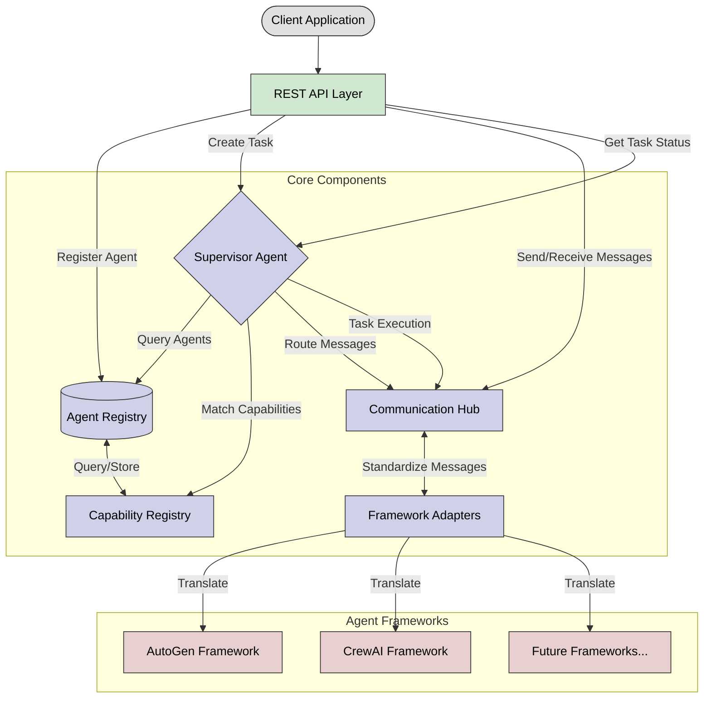

<div align="center">
  
  
  <h1>Agent Management Server (AMS)</h1>
  <p><em>Orchestrating AI Agents Across Frameworks</em></p>
  
  <!-- <p>
    <a href="https://github.com/sitloboi2012/ams/stargazers">
      
    </a>
    <a href="https://github.com/sitloboi2012/ams/network">
      
    </a>
    <a href="https://github.com/sitloboi2012/ams/issues">
      
    </a>
    <a href="https://github.com/sitloboi2012/ams/blob/main/LICENSE">
      
    </a>
  </p> -->
</div>

## 📋 Introduction

The Agent Management Server (AMS) is a powerful platform designed to streamline the management and orchestration of AI agents across various frameworks. Inspired by Kubernetes and the Model Context Protocol, AMS provides a unified interface for registering, managing, and orchestrating AI agents from different frameworks (AutoGen, CrewAI, etc.), enhancing productivity and innovation for developers.

With AMS, you can register agents from different frameworks, manage their metadata, and create powerful collaborations between them through a standardized system, without getting bogged down in framework-specific implementation details.

## ❓ Problem Statement

### Challenges for AI Agent Developers

Developers working with AI agents face several challenges:

1. **🔄 Framework Fragmentation**: Each agent framework (AutoGen, CrewAI, etc.) has its own API, concepts, and implementation details, creating a steep learning curve when working with multiple frameworks.

2. **🧩 Agent Orchestration Complexity**: Creating effective agent collaborations requires significant boilerplate code and deep knowledge of each framework's nuances.

3. **♻️ Limited Reusability**: Agents created in one framework cannot easily collaborate with agents from another framework, resulting in duplicated work.

4. **📈 Scaling Overhead**: As agent-based applications grow, managing agent lifecycle, communication, and task delegation becomes increasingly complex.

### How AMS Solves These Problems

The Agent Management Server addresses these challenges by:

1. **🔌 Unified Interface**: Providing a single, consistent API to work with agents from any supported framework, reducing the learning curve.

2. **🧠 Automated Orchestration**: Intelligently selecting and connecting the right agents for each task based on capabilities, not framework specifics.

3. **🌉 Framework Interoperability**: Enabling seamless collaboration between agents from different frameworks through standardized communication protocols.

4. **☸️ Kubernetes-Inspired Architecture**: Offering a scalable, robust system for managing agent registrations, capabilities, and communication.

5. **🧩 LLM-Based Capability Matching**: Unlike traditional systems that rely on keyword matching or hard-coded rules, AMS uses LLMs to intelligently match tasks to agent capabilities:
   - **Semantic Understanding**: Analyzes the meaning and intent behind tasks
   - **Rich Descriptions**: Capabilities are defined using natural language descriptions and example tasks
   - **Adaptive Selection**: Intelligently scores and ranks agents based on capability relevance
   - **Extensible Design**: Easy to add new capabilities without modifying code

By using AMS, developers can focus on building powerful agent-based applications without getting bogged down in framework-specific implementation details or complex orchestration logic.

## 🏗️ Architecture

The AMS architecture is designed with modularity and extensibility in mind:

1. **📦 Agent Registry**: Central registry that stores agent metadata and capabilities.
2. **🧠 Capability Registry**: Enables intelligent matching between tasks and agent capabilities using semantic understanding.
3. **🎮 Supervisor Agent**: Orchestrates collaborations by analyzing tasks and selecting appropriate agents.
4. **💬 Communication Hub**: Manages standardized message passing between agents.
5. **🔄 Framework Adapters**: Provides consistent interfaces to different agent frameworks (AutoGen, CrewAI, etc.).

### Architecture Diagram



The architecture shows how components work together:

- **Agent Registry** stores metadata about all registered agents
- **Capability Registry** enables semantic matching of tasks to agent capabilities
- **Supervisor Agent** orchestrates task execution and agent collaboration
- **Communication Hub** manages message passing between agents
- **Framework Adapters** provide consistent interfaces to different agent frameworks

## ✨ Features & Roadmap

AMS is being developed in phases, with each phase introducing new capabilities. Here's what's available now and what's coming in the future:

### 🎯 Phase 1: Foundation (Current)

**Available Now:**
- **📝 Framework Integration**: Support for AutoGen & CrewAI frameworks
- **🤖 Agent Management**: Register, configure, and manage agents with custom capabilities
- **💬 Communication**: Single-agent chat and multi-agent collaboration sessions
- **🧠 Intelligent Task Analysis**: Semantic matching of tasks to agent capabilities
- **🔄 Session Management**: Create, monitor, and control collaboration sessions
- **🛠️ Extensible Design**: Modular architecture that's easy to extend
- **🌐 REST API**: Complete RESTful API for integration with other systems

### 🔄 Phase 2: Advanced Framework Integration

**Coming Soon:**
- **AG2 Integration**: Support for AutoGen 2.0's enhanced capabilities
- **LlamaIndex Integration**: Knowledge retrieval and RAG capabilities
- **LangGraph Integration**: Structured agent workflows
- **Tool Integration Framework**: Unified tool registration and discovery
- **Cross-Framework Tool Sharing**: Use tools across different agent frameworks
- **Advanced Capability Matching**: Enhanced semantic understanding of tasks

### 💾 Phase 3: Memory and Knowledge Systems

**Planned:**
- **Long-Term Memory**: Persistent knowledge for agents across sessions
- **Shared Knowledge Bases**: Collaborative knowledge sharing between agents
- **Multi-Level Memory Architecture**: Working, short-term, and long-term memory
- **Knowledge Retrieval (RAG)**: Enhanced information access capabilities
- **Learning From Feedback**: Self-improvement based on task outcomes

### 🚀 Phase 4: Advanced Orchestration

**Future:**
- **Dynamic Task Decomposition**: Automated breaking down of complex tasks
- **Parallel Execution**: Run compatible subtasks simultaneously
- **Adaptive Workflows**: Adjust execution based on intermediate results
- **Multi-Modal Capabilities**: Vision, audio, and other input/output modalities
- **Complex Collaboration Patterns**: Pre-defined collaboration templates

### 🔒 Phase 5: Enterprise Features

**On the Horizon:**
- **Security and Access Control**: Fine-grained permissions system
- **Monitoring and Observability**: Comprehensive insight into system operations
- **Enterprise Deployment**: Kubernetes integration and scalability
- **High Availability**: Fault tolerance and redundancy
- **Enterprise Integrations**: Connect with existing business systems

### 🌐 Phase 6: Ecosystem and Community

**Long-Term Vision:**
- **Agent Marketplace**: Discover and share pre-built agents
- **Benchmarking Framework**: Standard metrics for agent performance
- **Plugin Architecture**: Community extensions and add-ons
- **Comprehensive Documentation**: Tutorials, guides, and references
- **Community Governance**: Sustainable open-source model

## 🚀 Installation

```bash
# Clone the repository
git clone https://github.com/sitloboi2012/ams.git
cd ams

# Install the package
pip install -e .
```

## 🔧 Usage

### Starting the Server

```bash
# Start the server with default settings
python -m ams

# Or use the CLI with specific settings
ams --host 0.0.0.0 --port 8000 --log-level info

# Start with a configuration file
ams --config config.yaml
```

### Configuration

AMS supports configuration through multiple methods, in order of precedence:

1. **Command-line arguments**: Highest precedence, overrides other settings
2. **Configuration file**: YAML file with structured configuration
3. **Environment variables**: Using the `AMS_` prefix (e.g., `AMS_PORT=8000`)
4. **Default values**: Built-in fallbacks

#### Configuration File Example

```yaml
# config.yaml
server:
  host: "0.0.0.0"
  port: 8000
  reload: false
  log_level: "info"
  workers: 4

database:
  url: "sqlite:///ams.db"
  echo: false
  pool_size: 5

security:
  secret_key: "your-secure-key-here"
  token_expiration: 1440
  enable_auth: true

llm:
  provider: "openai"
  api_key: ""
  default_model: "gpt-4"
  temperature: 0.7
```

To use a configuration file:

```bash
# Copy the example configuration
cp config.example.yaml config.yaml

# Edit as needed
nano config.yaml

# Start the server with your configuration
ams --config config.yaml
```

#### Environment Variables

You can use environment variables prefixed with `AMS_` to configure the system:

```bash
# Set environment variables
export AMS_PORT=9000
export AMS_LOG_LEVEL=debug
export AMS_LLM_PROVIDER=openai
export AMS_LLM_API_KEY=your-api-key

# Start the server
ams
```

### API Examples

#### Register an Agent

```bash
curl -X POST http://localhost:8000/agents \
  -H "Content-Type: application/json" \
  -d '{
    "name": "CodeGenerator",
    "description": "An agent that can generate code",
    "system_prompt": "You are a helpful assistant that specializes in writing code. You write clean, efficient, and well-documented code.",
    "framework": "autogen",
    "capabilities": [
      {
        "name": "code_execution",
        "description": "Can generate and execute code"
      }
    ],
    "config": {
      "llm_config": {
        "model": "gpt-4",
        "temperature": 0.1
      }
    }
  }'
```

#### Create a Task

```bash
curl -X POST http://localhost:8000/tasks \
  -H "Content-Type: application/json" \
  -d '{
    "task": "Write a Python function to calculate the Fibonacci sequence"
  }'
```

#### Get Messages from a Session

```bash
curl -X GET http://localhost:8000/tasks/{session_id}/messages
```

## 👏 Acknowledgements

- The Agent Management Server is inspired by the [Model Context Protocol (MCP)](https://github.com/microsoft/semantic-kernel/tree/main/python/semantic_kernel/connectors/ai/open_ai/model_context_protocol), but focuses on agent management rather than tools management.
- The architecture is inspired by [Kubernetes](https://kubernetes.io/) to provide a robust, scalable system for agent orchestration.

## 🤝 Contributing

We welcome contributions to the Agent Management Server! If you're interested in helping improve AMS, here's how you can contribute:

1. **🐛 Report Issues**: Submit bugs, suggest features, or help with documentation through GitHub Issues.
2. **💻 Submit Pull Requests**: Contribute code improvements, bug fixes, or new features.
3. **📚 Improve Documentation**: Help clarify usage, provide examples, or fix typos.
4. **🔌 Add Framework Adapters**: Extend AMS to support additional agent frameworks.

### Development Setup

```bash
# Clone the repository
git clone https://github.com/sitloboi2012/ams.git
cd ams

# Create a virtual environment
python -m venv venv
source venv/bin/activate  # On Windows: venv\Scripts\activate

# Install development dependencies
pip install -e ".[dev]"

# Run tests
pytest
```

### Pull Request Process

1. Fork the repository and create a feature branch.
2. Add tests for new functionality.
3. Ensure all tests pass.
4. Update documentation as needed.
5. Submit a pull request with a clear description of the changes.

Please refer to our [CONTRIBUTING.md](CONTRIBUTING.md) file for more details.

## 📚 References

If you use AMS in your research or project, please consider citing it:

```markdown
@software{AMS2025,
  author = {HenryVo},
  title = {Agent Management Server (AMS): A Kubernetes-inspired Platform for AI Agent Orchestration},
  year = {2023},
  url = {https://github.com/sitloboi2012/ams}
}
```

### Related Work

For more information on the concepts and technologies that inspired AMS, refer to:

1. Kubernetes: [Docs](https://kubernetes.io/)
2. Model Context Protocol: [Docs](https://github.com/modelcontextprotocol)
3. AutoGen: [Docs](https://github.com/microsoft/autogen)
4. CrewAI: [Docs](https://github.com/joaomdmoura/crewAI)

## 📄 License

MIT

## ⭐ Support

If you find AMS servers useful, please consider starring the repository and contributing to improve more!

## 📚 Documentation

- [API Reference](docs/api.md): Details on the REST API endpoints
- [Framework Adapters](docs/adapters.md): How framework adapters work
- [Agent Capabilities](docs/capabilities.md): Working with agent capabilities
- [Supervisor Guide](docs/supervisor.md): How the supervisor orchestrates collaborations
- [Extension Guide](docs/extending_ams.md): How to extend the system

