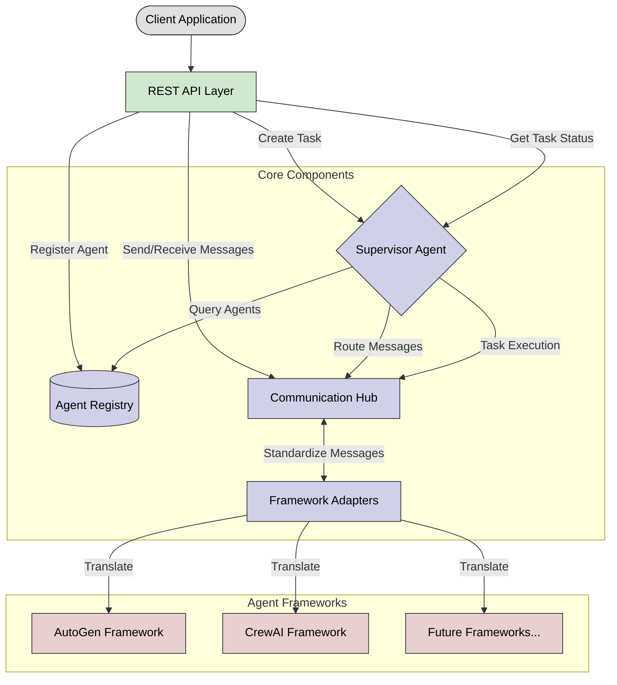

# 🤖 Agent Management Server (AMS)

A server for managing and orchestrating AI agents from different frameworks (AutoGen, CrewAI, etc.) in a unified way. The AMS allows you to register agents from different frameworks, manage their metadata, and orchestrate collaborations between them.

## 📋 Introduction

The Agent Management Server (AMS) is a powerful platform designed to streamline the management and orchestration of AI agents across various frameworks. Inspired by Kubernetes and the Model Context Protocol, AMS provides a unified interface for registering, managing, and collaborating with AI agents, enhancing productivity and innovation for developers.

## ❓ Problem Statement

### Challenges for AI Agent Developers

Developers working with AI agents face several challenges:

1. **🔄 Framework Fragmentation**: Each agent framework (AutoGen, CrewAI, etc.) has its own API, concepts, and implementation details, creating a steep learning curve when working with multiple frameworks.

2. **🧩 Agent Orchestration Complexity**: Creating effective agent collaborations requires significant boilerplate code and deep knowledge of each framework's nuances.

3. **♻️ Limited Reusability**: Agents created in one framework cannot easily collaborate with agents from another framework, resulting in duplicated work.

4. **📈 Scaling Overhead**: As agent-based applications grow, managing agent lifecycle, communication, and task delegation becomes increasingly complex.

### How AMS Solves These Problems

The Agent Management Server addresses these challenges by:

1. **🔌 Unified Interface**: Providing a single, consistent API to work with agents from any supported framework, reducing the learning curve.

2. **🧠 Automated Orchestration**: Intelligently selecting and connecting the right agents for each task based on capabilities, not framework specifics.

3. **🌉 Framework Interoperability**: Enabling seamless collaboration between agents from different frameworks through standardized communication protocols.

4. **☸️ Kubernetes-Inspired Architecture**: Offering a scalable, robust system for managing agent registrations, capabilities, and communication.

By using AMS, developers can focus on building powerful agent-based applications without getting bogged down in framework-specific implementation details or complex orchestration logic.

## 🏗️ Architecture

The AMS architecture is inspired by Kubernetes:

1. **📦 Agent Registry (like K8s etcd)**: Central registry that stores agent metadata and capabilities.
2. **🎮 Supervisor Agent (like K8s Control Plane)**: Analyzes tasks, selects appropriate agents, and manages collaborations.
3. **🔄 Framework Adapters (like K8s Container Runtime Interface)**: Provides standardized interfaces to different agent frameworks.
4. **💬 Communication Hub (like K8s Services/Network)**: Manages message passing between agents.

### Architecture Diagram



## ✨ Features

### Current Features
- 📝 Register and manage agents from different frameworks (currently AutoGen and CrewAI).
- 🔍 Analyze tasks to determine required capabilities.
- 🤝 Automatically select appropriate agents based on task requirements.
- 🔄 Create and manage collaboration sessions between agents.
- 💬 Send and receive messages between agents in a standardized way.
- 🌐 RESTful API for integration with other systems.

### Implementation Status

#### Completed

- [x] Integrated with AutoGen & CrewAI
- [x] Singular Agent Chat
- [x] Multi-Agent Collaboration
- [x] Agent / Task / Session / Messages Creation & Management  
- [x] Supervisor Agent
- [x] RESTful API Server

#### Upcoming

- [ ] Integrating with AG2 and LangGraph
- [ ] Tools & MCP Integrations
- [ ] Docker & Kubernetes Native Development & Deployment
- [ ] LLM Model Deployment with vLLM and vLLM Production Stack

## 🚀 Installation

```bash
# Clone the repository
git clone https://github.com/sitloboi2012/ams.git
cd ams

# Install the package
pip install -e .
```

## 🔧 Usage

### Starting the Server

```bash
# Start the server with default settings
python -m ams

# Or use the CLI
ams --host 0.0.0.0 --port 8000 --log-level info
```

### API Examples

#### Register an Agent

```bash
curl -X POST http://localhost:8000/agents \
  -H "Content-Type: application/json" \
  -d '{
    "name": "CodeGenerator",
    "description": "An agent that can generate code",
    "system_prompt": "You are a helpful assistant that specializes in writing code. You write clean, efficient, and well-documented code.",
    "framework": "autogen",
    "capabilities": [
      {
        "name": "code_execution",
        "description": "Can generate and execute code"
      }
    ],
    "config": {
      "llm_config": {
        "model": "gpt-4",
        "temperature": 0.1
      }
    }
  }'
```

#### Create a Task

```bash
curl -X POST http://localhost:8000/tasks \
  -H "Content-Type: application/json" \
  -d '{
    "task": "Write a Python function to calculate the Fibonacci sequence"
  }'
```

#### Get Messages from a Session

```bash
curl -X GET http://localhost:8000/tasks/{session_id}/messages
```

## 💻 Development

```bash
# Install development dependencies
pip install -e ".[dev]"

# Run tests
pytest

# Format code
black ams
isort ams
```

## 🗺️ Development Roadmap

- **🎯 Phase 1**: Initial release with core features for agent registration and task management.
- **🔄 Phase 2**: Integration with additional AI frameworks and enhanced task analysis capabilities.
- **🚀 Phase 3**: Advanced collaboration features and improved scalability.
- **👥 Phase 4**: Community feedback and iterative improvements based on user input.

## 👏 Acknowledgements

- The Agent Management Server is inspired by the [Model Context Protocol (MCP)](https://github.com/microsoft/semantic-kernel/tree/main/python/semantic_kernel/connectors/ai/open_ai/model_context_protocol), but focuses on agent management rather than tools management.
- The architecture is inspired by [Kubernetes](https://kubernetes.io/) to provide a robust, scalable system for agent orchestration.

## 🤝 Contributing

We welcome contributions to the Agent Management Server! If you're interested in helping improve AMS, here's how you can contribute:

1. **🐛 Report Issues**: Submit bugs, suggest features, or help with documentation through GitHub Issues.
2. **💻 Submit Pull Requests**: Contribute code improvements, bug fixes, or new features.
3. **📚 Improve Documentation**: Help clarify usage, provide examples, or fix typos.
4. **🔌 Add Framework Adapters**: Extend AMS to support additional agent frameworks.

### Development Setup

```bash
# Clone the repository
git clone https://github.com/sitloboi2012/ams.git
cd ams

# Create a virtual environment
python -m venv venv
source venv/bin/activate  # On Windows: venv\Scripts\activate

# Install development dependencies
pip install -e ".[dev]"

# Run tests
pytest
```

### Pull Request Process

1. Fork the repository and create a feature branch.
2. Add tests for new functionality.
3. Ensure all tests pass.
4. Update documentation as needed.
5. Submit a pull request with a clear description of the changes.

Please refer to our [CONTRIBUTING.md](CONTRIBUTING.md) file for more details.

## 📚 References

If you use AMS in your research or project, please consider citing it:

```markdown
@software{AMS2025,
  author = {HenryVo},
  title = {Agent Management Server (AMS): A Kubernetes-inspired Platform for AI Agent Orchestration},
  year = {2023},
  url = {https://github.com/sitloboi2012/ams}
}
```

### Related Work

For more information on the concepts and technologies that inspired AMS, refer to:

1. Kubernetes: [Docs](https://kubernetes.io/)
2. Model Context Protocol: [Docs](https://github.com/modelcontextprotocol)
3. AutoGen: [Docs](https://github.com/microsoft/autogen)
4. CrewAI: [Docs](https://github.com/joaomdmoura/crewAI)

## 📄 License

MIT

## ⭐ Support

If you find AMS servers useful, please consider starring the repository and contributing to improve more!

